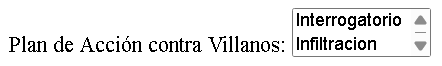

# Practica input, fieldset y legend.

## Enunciado.

A partir de la imagen proporcionada, debes escribir tu documento **HTML**:

 

La imagen es la siguiente:

*Ayuda:*

- En el select de **habilidades** son 5 opciones: combate cuerpo a cuerpo, tecnología, estrategia, investigacion y acrobacia. Pero el select solo visualiza sin desplegar una opcion.

- En el select de **Vehiculo Favorito** son 3 opciones: batmovil, batplano y batmoto. Pero el select visualiza sin desplegar dos opciones.

- En el select de **Villano favorito** son 6 opciones: joker, penguin, riddler, twoface, bane y catwoman. Peroo el select visualiza sin desplegar una opcion.

- En el select de **Plan de accion contra villanos** son 3 opciones: interrogatorio, infiltracion y confrontacion. Pero el select visualiza sin desplegar 2 opciones.

## Video ilustrativo.

<video src="Videos/video1.mp4" controls=""></video>
